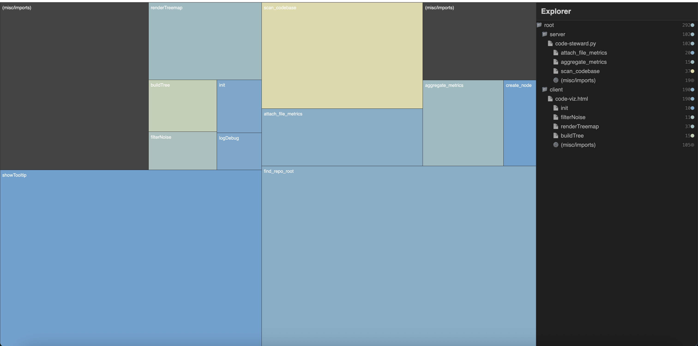

# Srcly

Srcly is an interactive codebase treemap, metrics, and code-flow viewer. It combines [Lizard](https://github.com/terryyin/lizard) with tree-sitter analyzers for richer language-specific signals, builds a hierarchical model of folders, files, functions, and nested scopes, and renders explorable views in your browser.

To try it in your current folder, run:

```
uvx srcly
```

## Screenshot



## Run it with `uvx srcly`

The easiest way to use Srcly is via [`uvx`](https://docs.astral.sh/uv/guides/tools/), no global install required.

```bash
uvx srcly           # analyze the current directory
uvx srcly ..        # analyze the parent directory
uvx srcly /path/to/repo
```

This will:

- start a FastAPI server backed by the Srcly analysis engine
- open your browser to the bundled single-page app
- default the analysis root to the directory you passed (or the current working directory)

Once the UI opens:

1. Type or paste a path into the path bar at the top, or leave it empty to analyze the directory you started `srcly` from.
2. Click **Analyze**.
3. Explore the treemap and click into files and functions to understand where complexity and LOC live in your codebase.

## Headless reports for agents

Srcly can also run without opening the UI and emit agent-ready artifacts:

```bash
uvx srcly report . --out .srcly
uvx srcly scan . --out .srcly/tree.json
uvx srcly hotspots . --metric complexity --limit 25
uvx srcly explain . --file client/src/App.tsx
```

By default, `uvx srcly report` writes compact artifacts intended to be safe for agents to inspect:

- `report.md` — human-readable summary, top targets, and compact tree breakdown.
- `findings.json` — machine-readable code-quality findings with metric evidence and agent prompts.
- `tree.summary.json` — compressed tree for quick agent context.
- `hotspots.json` — ranked metric hotspots.
- `metrics.schema.json` — metric definitions and interpretation hints.
- `agent-skill.md` — reusable guidance for agents consuming the report.

Use `uvx srcly scan . --out .srcly/tree.json` or `uvx srcly report . --include-tree` when you need the full raw tree. Use `--include-dependencies` to add the TypeScript/TSX dependency graph artifact.

## What Srcly shows you

- **Treemap of your codebase**
  - Each rectangle is a piece of your code: folders contain files, files contain functions and glue code.
  - Rectangle **area** ≈ lines of code (LOC) for that node.
  - Rectangle **color** is selectable from the hotspot metrics, such as complexity, LOC, file size, TODOs, nesting depth, TS/TSX metrics, Python imports, and Markdown data URLs.
  - Zoom into folders/files/scopes, isolate or exclude paths, filter by file type, and inspect metric legends from the treemap header.
- **Folder/file explorer sidebar**
  - A tree view of your codebase mirrored from the analysis model.
  - Sortable columns for LOC, complexity, file size, file count, ignored files, and supported language-specific metrics.
  - Hot Spots mode ranks files and scopes by one or more selected metrics.
  - Click any entry to focus the corresponding file in the treemap and open its contents.
- **Code viewer with syntax highlighting**
  - Click any file or function tile to open a modal with the underlying source.
  - Uses [Shiki](https://github.com/shikijs/shiki) for fast, dark-theme syntax highlighting.
  - Supports common languages (`.py`, `.ts`, `.tsx`, `.js`, `.jsx`, `.html`, `.css`, `.json`, `.md`, shell, etc.).
  - Markdown files render as a preview, and notebooks are converted to virtual text for inspection.
- **Scope and flow views**
  - Focus overlays highlight symbols inside the selected source range and show definition/scope context in tooltips.
  - Scope Flow renders nested lexical scopes with declared/captured symbols and optional arrows between related scopes.
  - Dependency Graph shows TypeScript/TSX import relationships, including external packages and nearby `tsconfig` path aliases.
  - Data Flow visualizes variable definitions and usages for a selected TypeScript/TSX file.
- **Path picker and recent folders**
  - Autocomplete-backed path input that talks to the server (`/api/files/suggest`).
  - Maintains a small list of recently analyzed paths in local storage for quick switching.
  - On first load, the UI can offer the server's current working directory and detected Git repository root.

## How the analysis engine works

The backend lives in the `server/app` package and is exposed as a FastAPI app.

- **Repository discovery & traversal**
  - Uses the working directory (or the path you pass to `srcly`) as the scan root.
  - Attempts to locate the repository root by walking up until it finds a `.git` folder.
  - Recursively walks the directory tree, skipping ignored directories like `node_modules`, `dist`, `.git`, and any patterns from `.gitignore`.
- **Static analysis**
  - Uses `lizard` for broad source-file coverage.
  - Uses tree-sitter analyzers for TypeScript/TSX, CSS/SCSS, Markdown, notebooks, and Python-specific enrichment.
  - Extracts function/scope definitions, cyclomatic complexity, LOC, comments, nesting, TODOs, class counts, and language-specific metrics per file and per function where available.
  - Runs files in separate worker processes with per-file hard timeouts so one bad file does not hang the full scan.
- **Structure building**
  - Constructs a hierarchical tree of `Node` objects mirroring your filesystem:
    - **Folders**: nested directory structure.
    - **Files**: each source file is a node.
    - **Functions/scopes**: each detected function or nested scope inside a file becomes a child node.
    - **Body fragments**: leftover lines inside parent scopes are represented separately so treemap area does not double-count nested scopes.
  - Aggregates metrics up the tree so every folder and file has useful rollups.
- **Caching**
  - Stores the full tree as `codebase_mri.json` in the analyzed root directory.
  - Subsequent requests reuse the cache until you explicitly refresh.

### API surface (used by the UI)

- **Analysis**
  - `GET /api/analysis?path=/path/to/repo` — return the full analysis tree; uses `codebase_mri.json` if present, otherwise scans.
  - `GET /api/analysis/context` — return the current server root and detected repository root with estimated file/folder counts.
  - `GET /api/analysis/dependencies?path=/path/to/repo` — build a TypeScript/TSX dependency graph.
  - `GET /api/analysis/data-flow?path=/absolute/path/to/file.tsx` — build a data-flow graph for one TS/TSX file.
  - `POST /api/analysis/focus/overlay` — return symbol overlay tokens for a selected source range.
  - `POST /api/analysis/focus/scope-graph` — return a nested scope graph for a selected source range.
  - `POST /api/analysis/refresh` — force a rescan of the current root.
- **Files**
  - `GET /api/files/content?path=/absolute/path/to/file` — fetch raw file contents for the code viewer.
  - `GET /api/files/suggest?path=/some/path` — return directory contents to power the path picker.

## Metrics

For every node (folder, file, function, or glue-code fragment), Srcly computes a consistent set of metrics and aggregates them into the `codebase_mri.json` output:

| Metric              | Description                               | Aggregation Logic                                                                              |
| :------------------ | :---------------------------------------- | :--------------------------------------------------------------------------------------------- |
| **LOC**             | Lines of Code (excluding comments/blanks) | **Sum** — folder LOC is the sum of all children                                                |
| **Complexity**      | Cyclomatic Complexity                     | **Max** for folders (shows the worst case)<br>**Average** for files<br>**Exact** for functions |
| **Function Count**  | Number of functions detected              | **Sum**                                                                                        |
| **File Count/Size** | Number of files and bytes on disk          | **Sum**                                                                                        |
| **Comments/TODOs**  | Comment lines, comment density, TODO count | **Sum** for counts; density is computed from aggregated comment lines and LOC                  |
| **Structure**       | Max nesting depth, average function length, parameter count, class count | **Max**, **average**, or **sum** depending on the metric                         |
| **TS/TSX**          | JSX nesting, render branches, `useEffect`, inline handlers, prop count, `any`, TS ignores, import coupling, hardcoded/duplicated strings, type/interface count, exports | **Sum** or **max** depending on whether the metric is a count or depth |
| **Python**          | Python import count                        | **Sum**                                                                                        |
| **Markdown**        | Markdown data URL count                    | **Sum**                                                                                        |

These metrics power treemap sizing/coloring, the Hot Spots ranking, explorer sorting, tooltips, and dependency graph coloring.

## Developing locally

If you want to hack on Srcly itself instead of running the packaged tool:

1. **Install server dependencies (with `uv`)**

   ```bash
   cd server
   uv sync
   ```

2. **Install client dependencies**

   ```bash
   cd client
   pnpm install
   pnpm dev       # start the Vite dev server on http://localhost:5173
   ```

3. **Run the API server**

   In another terminal:

   ```bash
   cd server
   uv run uvicorn app.main:app --reload --port 8000
   ```

   The SPA will be served from the Vite dev server in this setup. For a preview closer to the packaged experience, build the client and let FastAPI serve the static assets:

   ```bash
   cd client
   pnpm build

   cd ../server
   uv run uvicorn app.main:app --reload --port 8000
   ```

You can also use the `dev.sh` helper script in the repository root to start both the API server and the client dev server together (it assumes `pnpm` and `uv` are available).
